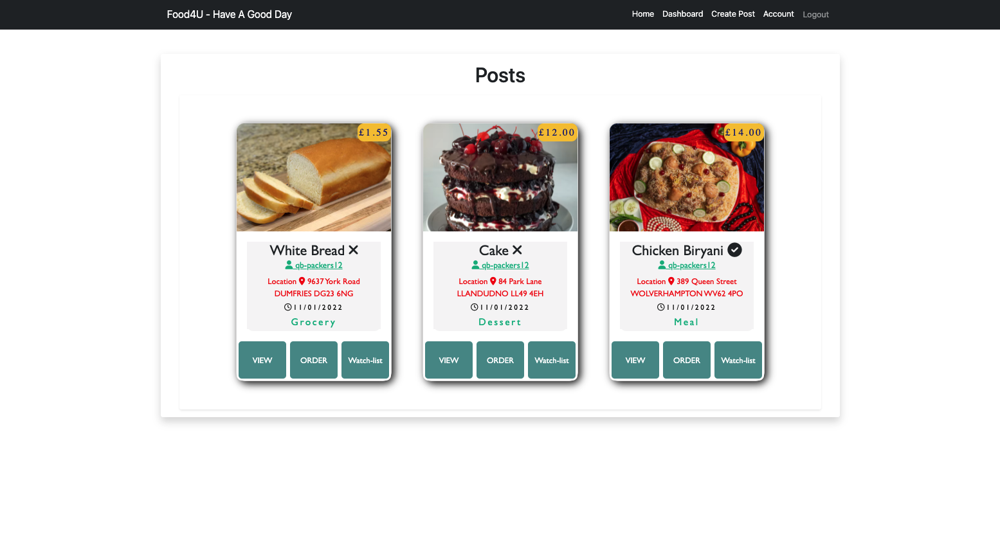

# food4U - Full-stack web application

An application using the MVC paradigm, with its own server-side API, user authentification, and which connects to a databse.

## Table Of Contents

- [Getting Started](#getting-started)
  - [Instalation](#instalation)
  - [Start Application](#start-application)
- [Contributors](#contributors)
- [About The Project](#about-the-project)
  - [Technologies Used](#technologies-used)
    - [Back-end](#back-end)
    - [Front-end](#front-end)
  - [Web APIs](#web-apis)
- [User Flow](#user-flows)
- [Deployed URL](#deployed-url)
- [Plans For Improvement](#plans-for-improvement)
- [Screenshots](#screenshots)
  - [Desktop Home Page](#desktop-home-page)
  - [Desktop Dashboard](#desktop-dashboard)
  - [Desktop My Posts](#desktop-my-posts)
  - [Desktop My Profile](#desktop-my-profile)
  - [Desktop Order Food](#desktop-order-food)
  - [Desktop Order History](#desktop-order-history)
  - [Desktop Post New Food](#desktop-post-new-food)
  - [Desktop View Post](#desktop-view-post)
  - [Mobile Login](#mobile-login)
  - [Mobile Home Page](#mobile-home=page)

## Getting Started

### Instalation

- $ git clone git@github.com:DMO17/food4U.git
- $ cd food4U
- $ npm install

### Start Application

- npm run dev
- seed database
- npm run seed

## Contributors

- [Anab](https://github.com/anabwarsame)
- [Andrada](https://github.com/andradag)
- [Asmaa](https://github.com/AsmaaMusse)
- [Dahir](https://github.com/DMO17)
- [Harman](https://github.com/AkenEagle)

## About The Project

Food4U is an application that provides food service for its clients and users. When a user logs in they are met by the dashboard which contains a random selection of food posts. The user can refine their search to their desired category out of groceries, dessert and meals.

As a user if i come across a post that i am interested in i can then proceed to view the food post in further detail and then place an order directly to the provider.

If the user comes across a few food posts that they are interested in, then they can add this to their watch-list page, whereby they can narrow down their search and pick what they would like to order.

For both the provider and user safety, in order for anyone to buy or sell their items they would have to create a profile where their details are verified. This allows the the user to be able to trace their goods back to the provider. This also gives the user a sense of security as they would feel more comfortable dealing with a verified page rather than an anonymous seller.

### Technologies Used

#### Back-end

- Node.js
- Express.js
- MySql

#### Front-end

- CSS
- JavaScript
- J-Query
- Handlebars

### Web APIs

The application is using its own server-side API.

## User Flow

- AS a user when I access the website I can see a public page with information about the app
- I can Login or Sign Up
- IF I sign up I can create an user profile, with contact information and description
- THEN I can create posts
- THEN I can edit and delete posts
- WHEN I am on the website as a buyer, I can see provider profile page
- THEN I can see more information on posts by clicking on them
- THEN I can add the item on my order and buy directly from the seller profile
- THEN I can view order history

## Deployed URL

The URL of the Heroku Application is available [here](https://food-4u.herokuapp.com/login)

The URL of the GitHub repository is available [here](https://github.com/andradag/food4U/tree/main).

## Plans For Improvement

- Watchlist
- Location using google maps API
- Using a direct messaging platform to contact the provider
- Commenting under food posts
- Reviewing each provider

## Screenshots

- Desktop Home Page

  

- Desktop Dashboard

  

- Desktop My Posts

  

- Desktop My Profile

  

- Desktop Order Food

  

- Desktop Order History

  

- Desktop Post New Food

  

- Desktop View Post

  

- Mobile Login

  

- Mobile Home Page

  
